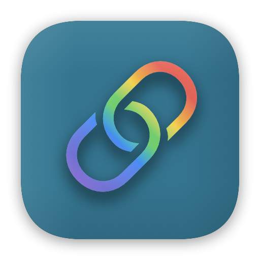
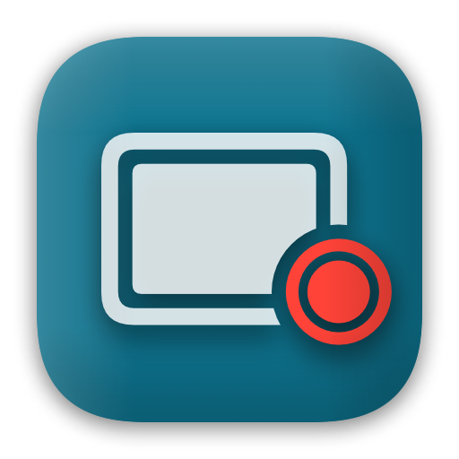
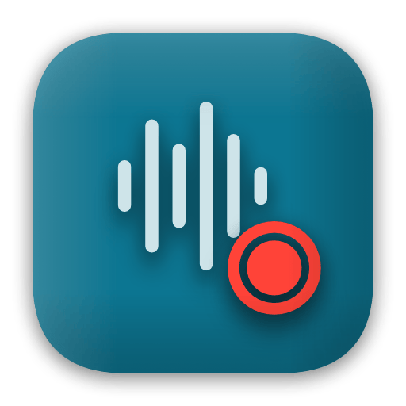
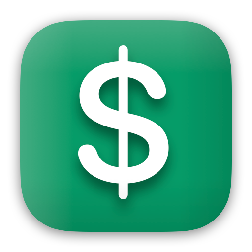
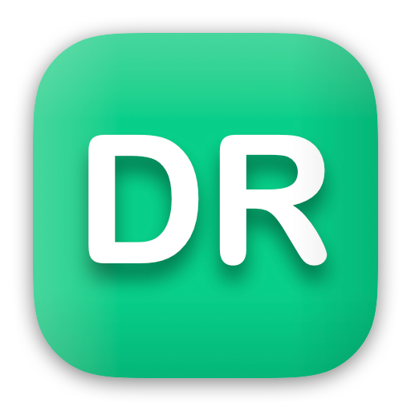
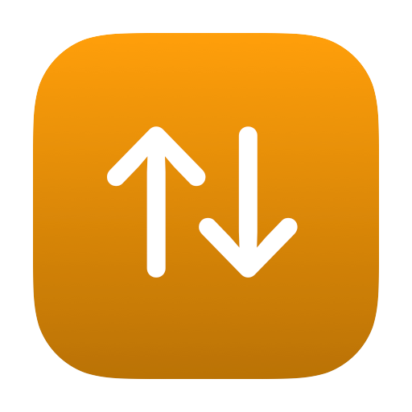
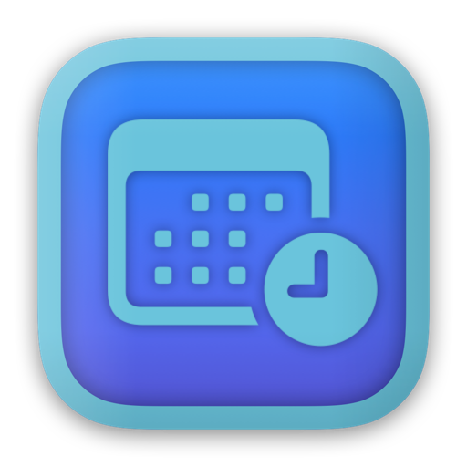
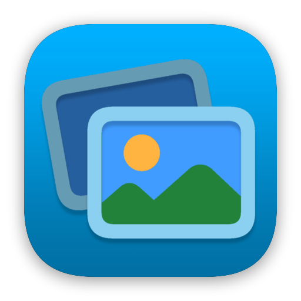

## 👋 Hi there

I am a software engineer developing applications for  Apple Platform with agile methodologies.

> Choose a job you love and you will never have to work a day in your life ~ Confucius

## 📝 About me

I started my adventure with mobile applications development back in Symbian days as a hobby, while the main focus still on backend application development. In 2011 I developed my first app for iOS, and it was a huge change activator in my career. Since then, I have helped many startups develop MVP as an iOS developer, working at a software house. I also gained a lot of experience with agile team management, quickly became a certified Scrum Master, and soon after that, I took the role of a Mentor in the iOS department. I value high quality of the product, no matter if it’s PoC, MVP, or full feature-rich system. I am a test-driven software development enthusiast and practitioner. When I am not working on product development, I like to explore agile ways to deliver high-quality code. In the meantime, I help teams and individuals to improve their skills in iOS application development, writing tests, and process management.

In the years 2011-2016, I had a [personal blog][personal-blog], but I am no longer maintaining it due to lack of time. I do, however, publish some open source projects from time to time. You can find them in my GitHub [repositories][github-repos] and [gists][github-gists], as well as in my [Swift Package Collection][swift-package-collection].

## 💪 What can I do for you

- I help teams and individuals to organize their work using agile methodologies
- I teach iOS & macOS developers how to write clean and maintainable code
- I educate about Test Driven Development for Apple platforms
- I help with implementing complex features and solving issues in iOS & macOS apps

[Click here][notion-projects] to check out some of the projects I developed or took part in the development of.

Check out my [products and services][gumroad-profile] on Gumroad.

## 📫 How to reach me

- [Twitter: @darrarski][twitter-profile]
- [mastodon.social: @darrarski][mastodon-profile]
- [LinkedIn][linkedin-profile]
- [Book a meeting][calcom-profile]

## 🅰️ Projects and Services

| [Linkmarks.app](https://linkmarks.darrarski.pl) |
| --- |
|  Universal solution for collecting links. Native iOS and macOS app. |

| [Recorder.app](https://macrecorder.app) |
| --- |
|  Versatile screen capture and camera recorder for macOS. Unlock the full potential of screen recording. |

| [AudioRecorder.app](https://audio.macrecorder.app) |
| --- |
|  Effortless audio recording on macOS. Record system audio and microphone with ease. No drivers required. Start recording immediately. |

| [Swifty Ledger](https://swifty-ledger.darrarski.pl) |
| --- |
|  Powerful and versatile iOS and macOS app for personal budget management. |

| [Darrarski.app](https://app.darrarski.pl) |
| --- |
|  Open source iOS & macOS SwiftUI application about my work and services. |

| [Sort Swift Imports](https://sort-swift-imports.darrarski.pl) |
| --- |
|  macOS app and Xcode extension for sorting imports in swift files. |

| [Total Hours](https://totalhours.darrarski.pl) |
| --- |
|  macOS utility app that allows summarizing the time of events in your calendar. |

| [Wallpapers Studio](https://github.com/darrarski/WallpapersStudio-iOS) |
| --- |
|  Open source iOS application that allows you to easily create wallpaper for your phone from the photos in your Photo Library. |

## 📚 Selected publications

- [SwiftUI Tabs View - customizable replacement for SwiftUI.TabView](https://github.com/darrarski/swiftui-tabs-view)
- [SwiftUI MKMapView - SwiftUI wrapper for MapKit's MKMapView (UIKit)](https://github.com/darrarski/SwiftUIMKMapView)
- [Sort Swift Imports - swift library, app and Xcode extension for sorting imports in swift files](https://github.com/darrarski/sort-swift-imports)
- [Swift Composable Presentation - navigation helpers for Composable Architecture](https://github.com/darrarski/swift-composable-presentation)
- [xcframework-maker - macOS utility for creating XCFramework with arm64-simulator support](https://github.com/darrarski/xcframework-maker)
- [Example source code for the Unidirectional Data Flow presentation](https://github.com/darrarski/UDFExamples)
- [Thoughts on SwiftUI navigation in a composable world](https://github.com/darrarski/darrarski/blob/main/2021/04/Thoughts-on-SwiftUI-navigation/README.md)
- [Swift Composable App Example - how to organize source code](https://github.com/darrarski/swift-composable-app-example)
- [SwiftUI App Icon Creator - create app icon in Xcode with SwiftUI](https://github.com/darrarski/swiftui-app-icon-creator)
- [Reading List Calendar - open source macOS app](https://dev.to/elpassion/reading-list-calendar-macos-app-3fmh) [[GitHub repo]](https://github.com/elpassion/ReadingListCalendarApp)
- [GitHub Status Bar - open source macOS App](https://github.com/darrarski/github-status-bar)
- [SwiftUI Navigation with Composable Architecture](https://github.com/darrarski/tca-swiftui-navigation-demo)
- [ScrollViewController - UIKit scroll view component](https://github.com/darrarski/ScrollViewController)
- [SwiftEndpoint - lightweight networking in Swift](https://github.com/darrarski/SwiftEndpoint)
- [State Restoration in iOS app - example](https://github.com/darrarski/iOS-State-Restoration)
- [SwiftUI iOS components](https://github.com/darrarski/SwiftUI-iOS-components)
- [Snapshot-based transitions in UIKit](https://dev.to/elpassion/reading-list-calendar-macos-app-3fmh)
- [Custom pagination in UIScrollView](https://dev.to/elpassion/custom-pagination-in-uiscrollview-c45)
- [Testing animations in UIKit](https://dev.to/elpassion/testing-animations-in-uikit-1fin)
- [DocumentBrowser iOS - swift library](https://github.com/darrarski/DocumentBrowser-iOS)

## ☕️ Do you like my open source work?

[personal-blog]: http://wp.darrarski.pl
[twitter-profile]: https://twitter.com/darrarski
[mastodon-profile]: https://mastodon.social/@darrarski
[linkedin-profile]: https://www.linkedin.com/in/darrarski
[github-profile]: https://github.com/darrarski
[github-repos]: https://github.com/darrarski?tab=repositories
[github-gists]: https://gist.github.com/darrarski
[swift-package-collection]: https://swiftpackageindex.com/darrarski
[calcom-profile]: https://cal.com/darrarski
[notion-projects]: https://darrarski.notion.site/7de8925b1ab7479b9cd29a89845a2b51
[gumroad-profile]: https://darrarski.gumroad.com
